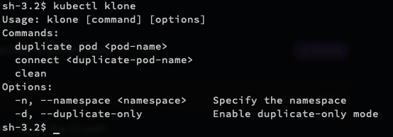
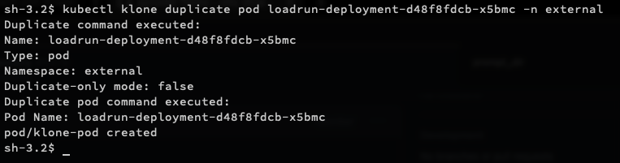
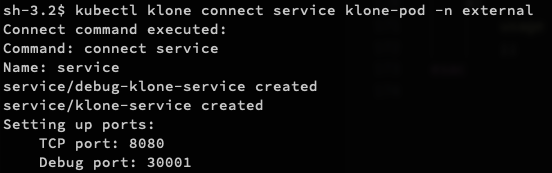
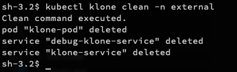

# kubectl-klone
Kubernetes scripts to replicate a deployment pod, with independent ingress attached to it. 

## About
kubectl klone extension helps create an isolated pod for a deployment.
Newly created pod has a new service and ingress path created for it. The egress dependencies remain same as other deployment pods. 

## How To
### Install

TODO: add installation instructions. 

#### Confirming installation
```
sh$ kubectl klone
```




### Duplicate a pod
```
sh$ kubectl klone duplicate pod <pod-name> -n external
```



### Connect to duplicated pod
```
sh$ kubectl klone connect service klone-pod -n external
```




clean up:
```
kubectl klone clean -n external
```


